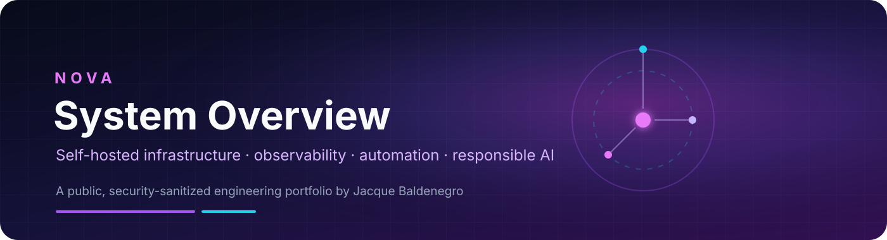

  

  <strong>Private by design. Observable by default. Honest about what is still being built.</strong>

Nova is my private, self-hosted personal operations platform. I use it to explore how infrastructure, monitoring, automation, documentation, recovery practices, and responsible AI concepts can work together as one understandable system.

This repository is a security-sanitized portfolio and case study. It explains the architecture and the work without publishing the private source repository, live configuration, credentials, addresses, hostnames, service data, or personal information.

## Related public prototype

I built the separate [Nova Support Knowledge Assistant](https://github.com/Ghostixs/nova-support-assistant) to test cited support retrieval, confidence-based routing, evaluation, and human handoff with synthetic content. The [live browser demo](https://ghostixs.github.io/nova-support-assistant/) is implemented and publicly inspectable. It is not connected to the private Nova runtime and is not described as a production AI or RAG system.

## Project status

Last runtime inspection: **August 30, 2026**

| Area | Status | What the evidence supports |
|---|---|---|
| Docker and WSL2 foundation | **Working** | The current environment runs under WSL2 with a substantial Docker service layer. |
| Service access and navigation | **Working** | Homepage and Caddy were running; Homepage also reported a healthy container state. |
| Observability | **Partial** | Prometheus, Grafana, Loki, Promtail, Node Exporter, and Uptime Kuma were running. Complete scrape, dashboard, alert, and retention behavior was not fully exercised during this audit. |
| Home automation | **Working** | Home Assistant was running. Internal entities, locations, and automations remain private. |
| Media workflow | **Working** | Request, management, download, VPN, subtitle, and playback services were running. Media data and private paths are not published. |
| Backup and recovery | **Partial** | Recovery artifacts and documented repair procedures exist. Off-host coverage and isolated restore testing are not complete for every service. |
| AI experimentation | **Partial** | Open WebUI was healthy at inspection. Production RAG, agent routing, MCP integration, and autonomous actions are not verified. |
| Public support-knowledge prototype | **Working, separate public project** | Browser demo, citations, policy handoff, and a 28-question synthetic regression set are implemented outside the private runtime. |
| Nova-native software | **In Development** | Nova Core and Nova Awareness source prototypes exist but are not deployed services. |
| Advanced AI operations | **Planned** | RAG retrieval evaluation, persistent AI memory, agent routing, MCP tools, and human-approved actions remain roadmap work. |

## Why I built Nova

I wanted a place where I could learn the full lifecycle of technical operations instead of studying each tool in isolation. Nova gives me a real environment in which to discover requirements, connect systems, troubleshoot failures, protect state, document decisions, and improve the experience of operating the whole platform.

The project is also a practical response to common operational problems:

- Service sprawl without a clear source of truth
- Configuration drift between intended and live state
- Limited visibility into health, metrics, and logs
- Recovery knowledge that exists only in one person's memory
- Automation ideas that need explicit safety and approval boundaries
- AI concepts that are easy to describe but much harder to validate responsibly

## Verified current capabilities

- Docker-based self-hosted environment under Linux and WSL2
- Private host-level networking through Tailscale
- Homepage navigation and Caddy reverse-proxy services
- Prometheus metrics, Grafana visualization, Loki logs, Promtail collection, Node Exporter, and Uptime Kuma
- Home Assistant for home-automation experimentation
- Jellyfin-centered media workflow with request, library, indexer, subtitle, download, and VPN components
- Vaultwarden for private credential management
- Open WebUI as an AI experimentation interface
- Git-based source control for engineering material
- Documented backup, recovery, troubleshooting, and verification procedures

## Architecture

  

The diagram deliberately shows trust boundaries and service groups rather than live network details. See [Architecture](docs/architecture.md) for the evidence model, data flows, and limitations.

## Technology stack

| Layer | Technologies |
|---|---|
| Host and runtime | Windows 11, WSL2, Ubuntu, Docker, Git |
| Private access | Tailscale, Caddy |
| Observability | Prometheus, Grafana, Loki, Promtail, Node Exporter, Uptime Kuma |
| Interfaces | Homepage, Portainer, Open WebUI |
| Home automation | Home Assistant |
| Media operations | Jellyfin, Jellyseerr, Sonarr, Radarr, Prowlarr, Bazarr, qBittorrent, Gluetun, Recyclarr, FlareSolverr |
| Documentation | Markdown, Mermaid, Obsidian, operational runbooks |
| AI roadmap | Retrieval evaluation, human review, model routing concepts, MCP concepts |

## What I personally implemented and learned

- Configured and operated the Docker and WSL2 service foundation
- Connected monitoring, logging, dashboard, automation, and media components
- Investigated runtime state when source files and documentation disagreed
- Diagnosed a difficult qBittorrent restart loop, preserved state, applied a minimal repair, and verified recovery with acceptance checks
- Reconciled reverse-proxy and network configuration after routing failures
- Built operational trackers, documentation, verification queues, recovery records, and public-safe architecture maps
- Practiced separating observed evidence from assumptions, prototypes, and roadmap ideas
- Learned why backup creation, restore testing, source control, access boundaries, and human review must be treated as separate controls

## Current limitations

- The private environment still has configuration and documentation drift to resolve.
- Some services run without application-level health checks.
- Observability services are running, but not every target, dashboard, alert, retention rule, or notification path has been independently verified.
- Backup coverage is uneven, and not every critical service has an off-host copy and isolated restore test.
- Security hardening is ongoing. Privileged integrations and service exposure require continued review.
- Nova Core and Nova Awareness are prototypes, not dependable platform services.
- No production RAG, agent, MCP, or autonomous-action capability is claimed.

## Responsible AI and human control

Nova's AI roadmap starts with an operational rule: the model is not the source of truth. Evidence, source provenance, approval boundaries, and recoverability matter more than an impressive demo.

Planned AI workflows will be evaluated for answer quality, failure behavior, permissions, logging, and human handoff before any action capability is considered. Actions that affect systems or data should remain explicit, reviewable, and reversible.

## Roadmap

- **Current foundation:** stability, monitoring, documentation, backups, private access, and operational dashboards
- **Near term:** reduce source drift, improve restore testing, strengthen authentication and secret handling, and expand the separate support-knowledge prototype with broader evaluation and content-governance criteria
- **Later:** RAG-backed memory, embedding and retrieval evaluation, agent routing, MCP-enabled tools, human-approved actions, model selection, voice interfaces, and hardware experimentation

Read the complete [Roadmap](docs/roadmap.md).

## Documentation

| Document | Purpose |
|---|---|
| [Architecture](docs/architecture.md) | Sanitized structure, trust boundaries, and data flows |
| [Current state](docs/current-state.md) | Component-by-component evidence and limitations |
| [Build history](docs/build-history.md) | Selected milestones and what changed |
| [Observability](docs/observability.md) | Metrics, logs, uptime, and verification boundaries |
| [Operations and recovery](docs/operations-and-recovery.md) | Change safety, backups, and recovery method |
| [Security and privacy](docs/security-and-privacy.md) | Publication boundaries and security posture |
| [Lessons learned](docs/lessons-learned.md) | Practical technical and operational takeaways |
| [Case study](docs/case-study-qbittorrent-recovery.md) | Evidence-led diagnosis and minimal repair |
| [Interview walkthrough](docs/interview-walkthrough.md) | A three-minute guided tour of Nova |

## Interview walkthrough

If you are reviewing this project for an interview, start with the [three-minute walkthrough](docs/interview-walkthrough.md), then open the [recovery case study](docs/case-study-qbittorrent-recovery.md). Together they show the current architecture, a real troubleshooting example, the limits of the project, and how I approach systems analysis.

## Privacy and security

The private Nova repository and its Git history have not been published or copied here. This repository contains newly written documentation, synthetic examples, and sanitized diagrams only. Screenshots were intentionally omitted because a useful screenshot could also disclose operational details.

For more information, read [Security and privacy](docs/security-and-privacy.md) and [SECURITY.md](SECURITY.md).
