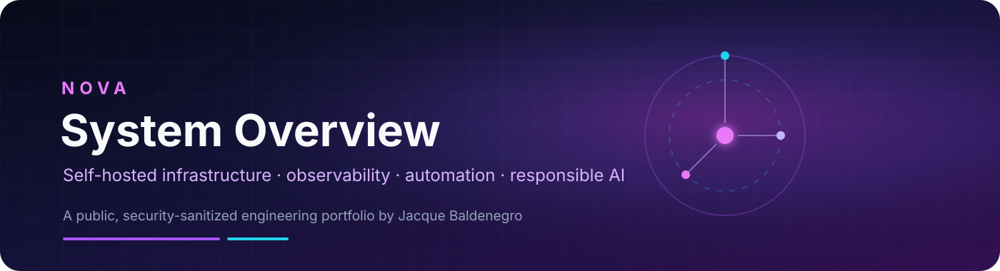

  

  <strong>Private by design. Observable by default. Honest about what is still being built.</strong>

Nova is a private, self-hosted personal operations platform that I design and operate across Windows, WSL2, and Docker. It brings infrastructure, monitoring, automation, documentation, recovery practices, and responsible AI experiments into one system I can understand, test, and improve.

This repository is a security-sanitized portfolio and case study. It explains the architecture and the work without publishing the private source repository, live configuration, credentials, addresses, hostnames, service data, or personal information.

  

## Project status

Latest media evidence: **October 6, 2026 — live owner-driven Level 1 production acceptance**. Platform baseline reconciled September 24; unrelated service details retain their August 31 inspection scope.

The technical evidence column records what was verified. The final column explains the practical meaning without changing the status or its limitations.

| Area | Status | What the evidence supports | Plain-language summary |
|---|---|---|---|
| Docker and WSL2 foundation | **Working** | The reconciled recovery baseline covers 22 expected services; experimental services are tracked separately. | Nova's core services are running together on a stable local foundation. |
| Boot recovery | **Validated** | A Windows AtLogOn task launches a passive WSL2 verifier with bounded convergence. Repeated cold boots ended healthy with no unexpected container recreation. | After a restart, Nova waits for core services to come online and verifies that they returned safely. |
| Service access and navigation | **Working** | Homepage and Caddy passed direct and routed availability checks across the Windows/WSL boundary. | The main dashboard and service routes are reachable from the host environment. |
| Observability | **Working foundation** | Prometheus verified three authoritative host/exporter target classes. Grafana, Loki, Promtail, Node Exporter, and Uptime Kuma were running; dashboard, alert, and retention coverage still varies. | Nova can monitor the health of its main systems, though monitoring coverage is still growing. |
| Home automation | **Working** | Home Assistant was running. Internal entities, locations, and automations remain private. | Home-automation services are available, while private household details remain unpublished. |
| Media workflow | **Level 1 operational; live production accepted** | Owner used the installed operator interface for Gran Dillama; acquisition, Gate validation, release, Sonarr import, Jellyfin delivery and cleanup verified. Latest aggregate regression: 614 PASS, zero skips. | Owner-attended and publisher-restricted; APPROVE and post-validation RELEASE required for every item. Indexers/RSS/search disabled by policy; Radarr deferred; Level 2 not enabled. |
| Backup and recovery | **Partial** | Recovery artifacts, controlled repair procedures, and boot verification exist. Off-host coverage and isolated restore testing are not complete for every service. | Nova has documented recovery options, but not every service yet has complete off-site backup and restore proof. |
| AI experimentation | **Experimental** | Open WebUI was healthy at inspection. Production RAG, agent routing, MCP integration, and autonomous actions are not verified. | The current AI interface can be tested, but advanced Nova intelligence is not a production capability yet. |
| Nova-native software | **In Development** | Nova Core and Nova Awareness source prototypes exist but are not deployed services. | Nova's own software is being built but is not running as a live service yet. |
| Advanced AI operations | **Planned** | RAG evaluation, persistent AI memory, agent routing, MCP tools, and human-approved actions remain roadmap work. | More advanced AI and tool-use capabilities are on the roadmap and have not been built yet. |

## Recent engineering milestone: NOVA Media Level 1

- Isolated staging keeps untrusted content away from media consumers.
- Real filename/type, libmagic, FFprobe, ClamAV and Defender evidence bind to the same file identity.
- Validation, release and import are separate decisions: **PASSED ≠ RELEASED ≠ IMPORTED**.
- The download client moves content; the Gate verifies completion before release.
- Production-shaped 6.6 MB, 25 MB and 130 MB fixtures reached RELEASED. **471 Gate + 26 deployment tests passed, zero skips.**
- Production admission no longer depends on the offline-only wrapper. Pinned, read-only disk input resolves the earlier whole-file **16 MiB** constraint; existing parser resource limits and the scanner ceiling remain unchanged.
- The read-only release-to-import contract progressed from disposable qualification to actual production Sonarr import and Jellyfin delivery. Temporary per-package exposure is withdrawn after use; CDH returns OFF.
- **NOVA Media Level 1 is operational in owner-attended, publisher-restricted gated mode.**
- **Live owner-driven acquisition, validation, release, import and Jellyfin delivery verified.**
- The owner-facing interface abstracts WSL, containers, downloader and import operations while keeping Gate security authority independent. A failed startup attempt downloaded no media; separately authorized recovery did not reuse its approval.

Read [Building a Fail-Closed Media Acquisition Pipeline](docs/case-study-download-security-gate.md).

## Why I built Nova

I wanted a place where I could learn the full lifecycle of technical operations instead of studying each tool in isolation. Nova gives me a real environment in which to discover requirements, connect systems, troubleshoot failures, protect state, document decisions, and improve the experience of operating the whole platform.

The project is also a practical response to common operational problems:

- Service sprawl without a clear source of truth
- Configuration drift between intended and live state
- Limited visibility into health, metrics, and logs
- Recovery knowledge that exists only in one person's memory
- Asynchronous startup behavior hidden by fixed delays
- Automation ideas that need explicit safety and approval boundaries
- AI concepts that are easy to describe but much harder to validate responsibly

## Verified capabilities and dated foundation

- Docker-based self-hosted environment under Linux and WSL2
- Private host-level networking through Tailscale
- Homepage navigation and Caddy reverse-proxy services
- Prometheus metrics with three verified authoritative target classes
- Grafana visualization, Loki logs, Promtail collection, Node Exporter, and Uptime Kuma
- Production-validated, fail-closed post-logon convergence verification
- Home Assistant for home-automation experimentation
- Jellyfin-centered services with live owner-driven Level 1 acquisition, Gate validation, explicit release, import and cleanup verified
- Vaultwarden for private credential management
- Open WebUI as an AI experimentation interface
- Git-based source control for engineering material
- Documented backup, recovery, troubleshooting, and verification procedures

## Architecture

  

The diagram shows trust boundaries and service groups rather than live network details. [View the readable architecture diagrams](docs/architecture.md#diagrams) or [inspect the Mermaid source](diagrams/nova-public-architecture.mmd).

Nova's boot path is documented separately because startup convergence is easier to understand as a sequence. [View the readable Boot Recovery sequence](docs/case-study-boot-recovery.md#2-architecture) or [inspect its Mermaid source](diagrams/nova-boot-recovery.mmd).

## About the Builder

**Designed, built, operated, tested, and documented by Jacque.**

Nova is my personal systems engineering project focused on reliability, security boundaries, observability and recoverable infrastructure. It demonstrates hands-on learning and evidence-led implementation, rather than a claim of professional security credentials.

## Technology stack

| Layer | Technologies |
|---|---|
| Host and runtime | Windows 11, WSL2, Ubuntu, systemd, Docker, Git |
| Private access | Tailscale, Caddy |
| Boot verification | Windows Task Scheduler, PowerShell, Bash, bounded health and dependency gates |
| Observability | Prometheus, Grafana, Loki, Promtail, Node Exporter, Uptime Kuma |
| Interfaces | Homepage, Portainer, Open WebUI |
| Home automation | Home Assistant |
| Media operations | Jellyfin, Jellyseerr, Sonarr, Radarr, Prowlarr, Bazarr, qBittorrent, Gluetun, Recyclarr, FlareSolverr |
| Download validation | Python, SQLite, Bubblewrap, libmagic, FFprobe, ClamAV, Microsoft Defender |
| Documentation | Markdown, Mermaid, Obsidian, operational runbooks |
| AI roadmap | Retrieval evaluation, human review, model routing concepts, MCP concepts |

## Selected engineering work

- Built and qualified a durable validation/release boundary across Windows, WSL2 and Linux, including actual asynchronous moves and restart behavior

- Diagnosed runtime/source drift and rebuilt an evidence-backed operating baseline
- Recovered stateful services from stale cross-distro bind mounts without resetting application state
- Diagnosed a qBittorrent restart loop, preserved state, applied a minimal repair, and verified recovery with acceptance checks
- Reconciled reverse-proxy and media storage paths after routing and mount failures
- Built authoritative Windows, WSL2, and container telemetry
- Designed a passive boot verifier with fail-closed VPN checks and bounded convergence
- Used repeated real cold boots to isolate Docker, VPN, proxy, and telemetry timing races
- Built operational trackers, verification queues, recovery records, and public-safe architecture maps
- Separated observed evidence from assumptions, prototypes, and roadmap ideas

## Current limitations

- Current media operation is attended Level 1 within approved publisher/mapping scope. Arbitrary downloads, automated discovery, Radarr, above-ceiling media and Level 2 remain outside the approved scope.

- The private environment still has configuration and documentation drift to resolve.
- Some services lack application-level health checks.
- Observability targets are verified, but dashboard, alert, notification, and retention coverage is not uniform.
- Backup coverage is uneven, and not every critical service has an off-host copy and isolated restore test.
- The boot verifier observes and classifies convergence; it is not a general-purpose remediation engine.
- Security hardening is ongoing. Privileged integrations and service exposure require continued review.
- Nova Core and Nova Awareness are prototypes, not dependable platform services.
- No production RAG, agent, MCP, or autonomous-action capability is claimed.

## Responsible AI and human control

Current development uses owner-scoped, AI-assisted campaigns with acceptance evidence and explicit stop conditions. [Human-governed AI engineering](docs/operations-and-recovery.md#human-governed-ai-engineering) describes the method.

Nova's AI roadmap starts with an operational rule: the model is not the source of truth. Evidence, source provenance, approval boundaries, and recoverability matter more than an impressive demo.

Planned AI workflows will be evaluated for answer quality, failure behavior, permissions, logging, and human handoff before any action capability is considered. Actions that affect systems or data should remain explicit, reviewable, and reversible.

## Roadmap

- **Completed:** Gate architecture/deployment/admission, release/moving safety, tested recovery, Internet acquisition, Sonarr/Jellyfin delivery, Level 1 policy/enablement, emergency rollback/re-entry, installed owner interface and first live owner transaction.
- **Current:** **USE AND OBSERVE** in accepted **LEVEL 1 — OWNER-ATTENDED MANUAL GATED** mode.
- **Optional future:** owner-requested publisher/mapping support, sidecars, Radarr, >2 GiB strategy and UX improvements. Level 2 needs a deliberate separate decision.
- **Later:** broader recovery and observability coverage, supported content expansion, evaluated retrieval/MCP and home-automation capabilities.

Read the complete [Roadmap](docs/roadmap.md).

## Documentation

For a concise interview walkthrough: [Gate case study](docs/case-study-download-security-gate.md) -> [Architecture](docs/architecture.md) -> [Boot Recovery V1 case study](docs/case-study-boot-recovery.md) -> [Current state](docs/current-state.md) -> [Roadmap](docs/roadmap.md).

| Document | Purpose |
|---|---|
| [Architecture](docs/architecture.md) | Sanitized structure, trust boundaries, and data flows |
| [Current state](docs/current-state.md) | Component-by-component evidence and limitations |
| [Build history](docs/build-history.md) | Selected milestones and what changed |
| [Observability](docs/observability.md) | Metrics, logs, availability, and verification boundaries |
| [Operations and recovery](docs/operations-and-recovery.md) | Change safety, backups, boot verification, and recovery method |
| [Security and privacy](docs/security-and-privacy.md) | Publication boundaries and security posture |
| [Lessons learned](docs/lessons-learned.md) | Practical technical and operational takeaways |
| [Download Security Gate case study](docs/case-study-download-security-gate.md) | Isolation, state machines, real validation, asynchronous release and bounded recovery |
| [Boot Recovery V1 case study](docs/case-study-boot-recovery.md) | Bounded post-logon convergence across Windows, WSL2, Docker, VPN, proxy, and telemetry |
| [qBittorrent recovery case study](docs/case-study-qbittorrent-recovery.md) | Evidence-led diagnosis and minimal repair |

## Privacy and security

The private Nova repository and its Git history have not been published or copied here. This repository contains newly written documentation, synthetic examples, and sanitized diagrams only. Screenshots were intentionally omitted because a useful screenshot could also disclose operational details.

For more information, read [Security and privacy](docs/security-and-privacy.md) and [SECURITY.md](SECURITY.md).
