# Architecture

[Back to project overview](../README.md)

## Purpose

Nova is a private personal operations environment. Its mature layer is the self-hosted infrastructure. Native AI memory and action systems remain prototypes or roadmap work.

The public architecture intentionally omits addresses, hostnames, domains, device identities, exact storage paths, service credentials, and security-sensitive routing details.

## Evidence model

Claims in this repository use the following order of authority:

1. Current runtime and service state
2. Current configuration and source files
3. Git working tree and history
4. Reviewed technical documentation
5. Older plans and architecture material

When two sources disagree, the discrepancy is documented as drift. A plan is never promoted to a working capability because a directory or design document exists.

## Status language

| Status | Meaning |
|---|---|
| **Working** | Direct current evidence supports the running component or capability. |
| **Validated** | A defined acceptance test passed for the behavior described. |
| **Partial** | Important evidence exists, but end-to-end behavior, recovery, or coverage is incomplete. |
| **Experimental** | A running interface or limited capability is under evaluation and is not a production claim. |
| **In Development** | Source or a prototype exists, but it is not a dependable deployed capability. |
| **Planned** | An intended future capability with no current implementation claim. |

## Diagrams

### High-level architecture

  

[View Mermaid source](../diagrams/nova-public-architecture.mmd)

### Runtime service map

  

[View Mermaid source](../diagrams/nova-runtime-service-map.mmd)

### Boot Recovery sequence

  

[View Mermaid source](../diagrams/nova-boot-recovery.mmd) · [Read the Boot Recovery case study](case-study-boot-recovery.md)

## High-level structure

At a high level:

1. A Windows host provides the desktop environment, user-logon trigger, and native private networking.
2. WSL2 runs an Ubuntu environment that hosts systemd, Docker-facing engineering workflows, and native telemetry.
3. Docker runs grouped services for core operations, system health, administration, home automation, media operations, credentials, and AI experimentation.
4. Git and technical documentation preserve source history, decisions, verification evidence, and recovery knowledge.
5. A passive Boot Recovery verifier checks bounded dependency convergence after logon without recreating containers.
6. Nova-native memory and agent capabilities remain outside the working service layer until they are implemented and evaluated.

## Current service groups

### Core Operations

Home Assistant connects smart-home devices and automations. Vaultwarden stores encrypted credentials under self-hosted control. The media workflow coordinates requests, libraries, subtitles, and playback. The VPN-routed download path keeps download traffic behind a fail-closed network boundary.

### System Health & Observability

Prometheus and Node Exporter collect host and service health metrics. Three authoritative target classes are currently verified. Grafana turns telemetry into dashboards. Loki and Promtail collect and store operational logs. Uptime Kuma checks service reachability.

The metrics foundation is working. Dashboard, alert, notification, and retention coverage remains uneven, so individual observability capabilities still carry explicit limitations.

### Dashboards & Administration

Homepage provides a central dashboard. Caddy routes secure traffic to Nova services. Portainer provides visual container administration. Open WebUI provides an interface for AI experimentation.

### Engineering Source & Recovery Knowledge

The private Git repository tracks deployment source and history. Technical documentation explains architecture, operating decisions, recovery evidence, and safe procedures. The public repository is a separately sanitized portfolio surface.

### Nova Intelligence Roadmap

Nova Core is an early knowledge-foundation prototype. Nova Awareness explores context about system state and activity. RAG and retrieval, agent routing, MCP-enabled tools, and human-approved actions remain development or roadmap capabilities rather than production claims.

## Boot Recovery V1

Nova's startup path crosses independent Windows, WSL2, systemd, Docker, VPN, proxy, application, and telemetry domains. V1 uses bounded convergence rather than a fixed delay:

- Docker readiness: up to 150 seconds
- VPN convergence: up to 90 seconds
- authoritative telemetry convergence: up to 60 seconds
- global verification deadline: 300 seconds

The Windows launcher remains thin. The Linux verifier checks a 22-container manifest, critical identity and restart stability, fail-closed VPN behavior, cross-boundary Caddy reachability, core applications, and telemetry. It reports a classified exit code and does not recreate containers.

Read [Case Study: Nova Boot Recovery V1](case-study-boot-recovery.md).

## Trust boundaries

- **Public repository:** documentation, diagrams, and synthetic examples only
- **Private source repository:** engineering source and deployment material
- **Runtime configuration:** private service definitions and operational settings
- **Persistent service data:** databases, logs, credentials, and personal content
- **Host networking:** private routes, identities, and access policy
- **AI experimentation:** limited to explicit experiments, with production actions still planned

## Architecture decisions that matter

- Keep the private system separate from the public portfolio.
- Treat live evidence as stronger than stale documentation.
- Model startup as bounded dependency convergence, not fixed sleeps.
- Preserve fail-closed invariants while waiting for a dependency.
- Preserve state before repair and keep rollback steps explicit.
- Separate backup creation from restore verification.
- Avoid presenting a running interface as a completed AI capability.
- Require provenance, permissions, logging, evaluation, and human approval before future action workflows.
