# Case Study: Nova Boot Recovery V1

## 1. Operational Problem

Nova spans Windows, WSL2, systemd, Docker Desktop, a private VPN gateway, application containers, and host-level telemetry. Those layers do not become ready at the same time.

A simple start-at-logon script would answer the wrong question: whether a command ran. The operational question was whether the existing platform had converged safely without changing container identity, bypassing the VPN kill switch, or mistaking a temporarily unready dependency for a failed system.

The design needed to handle:

- per-user Docker Desktop startup after Windows logon;
- WSL2 and systemd becoming available before Docker;
- a VPN gateway whose health can legitimately pass through transitional states;
- a download client sharing the VPN container's network namespace;
- Docker-published HTTPS reached across a Windows/WSL boundary;
- Prometheus becoming server-ready before its first successful target scrapes; and
- a hard upper bound on how long boot verification may wait.

## 2. Architecture

The production flow is intentionally small:

```text
Windows user logon
→ 30-second delayed Scheduled Task
→ hidden, non-interactive PowerShell launcher
→ WSL2 Linux environment
→ passive Bash verifier
→ classified process exit
```

The PowerShell layer only wakes the selected WSL2 environment, starts the Linux verifier, and propagates its exit code. Recovery logic, Docker commands, credentials, and network configuration are not embedded in the Windows launcher.

The Linux verifier checks a manifest of **22 expected persistent containers** and selected service behaviors. It writes a timestamped report and keeps a pointer to the newest result.



## 3. Reliability & Safety Constraints

The verifier is passive and fail-closed.

It does not pull images, run Compose, recreate containers, restart Docker, alter firewall rules, reconnect the VPN, or modify application settings. Its job is to wait within bounded limits, inspect current state, and return evidence.

The safety model verifies:

- expected container presence and image identity;
- running state and health where available;
- container ID and restart-count stability;
- VPN tunnel interface presence;
- firewall output policy remaining fail-closed;
- the download client's namespace attachment to the current VPN container;
- expected persistent mounts;
- application and outbound-connectivity probes; and
- authoritative telemetry target health.

If a VPN state is transitional, waiting is allowed only while container identity and restart stability hold. A transient unhealthy state is tolerated only while the firewall remains fail-closed.

## 4. Bounded Convergence Design

| Dependency | Maximum local grace | Polling interval | Failure class |
|---|---:|---:|---|
| Docker readiness | 150 seconds | 5 seconds | Platform readiness |
| VPN convergence | 90 seconds | 5 seconds | VPN/download safety |
| Prometheus targets | 60 seconds | 5 seconds | Telemetry degraded |
| Whole verifier | 300 seconds | — | Global bound |

Every local gate is also bounded by the remaining global deadline. The design never adds all local maximums blindly; a slow early dependency reduces the time available to later gates.

The verifier exits immediately when a gate reaches a stable passing state. Poll cycles are not logged verbosely. Reports record the initial degraded condition when useful, the elapsed convergence time, and the final per-target or per-service state.

## 5. Failure Modes Discovered

Repeated real cold boots uncovered four independent readiness assumptions.

### Docker was not ready when WSL2 was ready

The first implementation performed a one-shot Docker check. On a cold boot, the task reached WSL2 before Docker Desktop finished starting. Bounded Docker polling replaced the fixed assumption.

### WSL loopback was not Windows-host loopback

Caddy was healthy and published on the Windows host, but a probe to Linux loopback inside WSL2 failed. The verifier now resolves the Windows host dynamically and sends the existing HTTPS hostname checks through that address. No private address is hard-coded or published.

### Prometheus readiness preceded target readiness

Prometheus returned ready before all authoritative exporters had completed successful scrapes. The verifier now treats server readiness and target convergence as separate gates.

### VPN health was asynchronous

The VPN container could still be starting—or briefly report unhealthy—while the tunnel and fail-closed firewall were converging correctly. The final gate polls transitional health, monitors container identity and restart count, checks fail-closed behavior during unhealthy periods, and requires a healthy endpoint plus tunnel, firewall, and restart-stability evidence.

These were not one bug. They were separate examples of asynchronous distributed startup.

## 6. Testing Strategy

Validation advanced in increasingly realistic stages:

1. static syntax and prohibited-command review;
2. Linux audit-only execution;
3. before/after mutation snapshots of all 22 containers;
4. PowerShell launcher syntax and exit-code propagation;
5. Scheduled Task definition read-back;
6. one controlled on-demand scheduler run;
7. repeated real Windows cold boots; and
8. final production cold-boot acceptance.

Each test compared container IDs, running states, health states, and restart counts before and after. A successful report was not enough if the verifier itself caused unexpected lifecycle changes.

## 7. Production Validation

The final production cold boot passed:

- AtLogOn trigger and delay;
- Docker readiness polling;
- bounded VPN convergence;
- fail-closed VPN and download-client safety;
- cross-boundary Caddy reachability;
- authoritative Prometheus target convergence;
- critical application probes; and
- process exit propagation through Linux, PowerShell, and Task Scheduler.

Quantitative result:

- **22** expected persistent containers
- **150-second** Docker readiness ceiling
- **90-second** VPN convergence ceiling
- **60-second** telemetry convergence ceiling
- **300-second** global deadline
- **0** final task result
- **0** unexpected container recreations

## 8. Observability & Evidence

Every run produces a timestamped report with:

- verifier mode and deadline;
- manifest validation;
- platform and systemd state;
- dependency convergence durations;
- per-gate pass, warning, or failure evidence;
- a final classification and recommended exit code; and
- total elapsed time.

The scheduler preserves the verifier's exit code, allowing the same evidence to be read from the report and from Windows Task Scheduler history.

The public documentation publishes the design and sanitized quantitative results. It does not publish hostnames, addresses, private routes, account paths, container identifiers, credentials, or raw operational logs.

## 9. Engineering Lessons

- Startup should be modeled as dependency convergence, not a fixed sleep.
- Server readiness and downstream data readiness are different conditions.
- Cross-platform loopback assumptions require direct testing.
- A transient unhealthy signal can be safe only when a stronger invariant—such as a fail-closed firewall—remains true.
- Waiting must be bounded locally and globally.
- Recovery automation should not broaden its authority just because a dependency is slow.
- Mutation proof is part of testing an operational verifier.
- Real cold boots reveal races that warm tests cannot.

## 10. What's Next

The V1 core is frozen except for separately reviewed bug fixes. Future work should focus on:

- reviewing source and runtime drift before the next private commit;
- expanding restore testing and failure-domain-separated backups;
- improving application-native health coverage;
- refining alert ownership and notification paths; and
- evaluating whether later recovery phases should remain verification-only or introduce narrowly approved remediation.

Any future mutating recovery behavior should be designed as a separate capability with its own authorization, rollback, and test model.
