# Building a Fail-Closed Media Acquisition Pipeline

[Project overview](../README.md) · [Current state](current-state.md) · [Roadmap](roadmap.md)

**NOVA Media Level 1 is operational in owner-attended, publisher-restricted gated mode.**

**Live owner-driven acquisition, validation, release, import and Jellyfin delivery verified.**

Current acceptance: **October 6, 2026**, based on the completed owner-run transaction and retained acceptance records. Earlier qualification milestones remain historical.

NOVA is my personal infrastructure engineering project across Windows, Linux, WSL2 and Docker. This case study describes how I separated untrusted downloads, validation, release and import. It is an account of a bounded engineering qualification, with explicit limits on what was proved.

## Problem

The original media automation design gave download clients and media managers broad access to a shared filesystem. That made the workflow convenient, but it did not establish a clear point at which downloaded bytes became eligible for import. A scanner result alone could not solve the problem: a consumer that could already read the file might import it before validation or during a move.

I needed a practical workflow that preserved existing library state while making the trust transitions explicit. The design had to fail closed when a parser, scanner, runtime dependency or identity check failed, and retain enough evidence to diagnose and recover without silently approving content.

## Design and boundaries

The deployed portion uses isolated Linux staging, a durable validation ledger and a separate release destination. Media managers cannot see staging or moving release content. The download client performs the supported move; the Gate decides whether the observed result satisfies the release contract.

[Open diagram](../diagrams/nova-gate-sequence.svg) · [Mermaid source](../diagrams/nova-gate-sequence.mmd)

The diagram preserves the earlier scanner-preflight checkpoint. Its future-step labels are historical; the later milestones below qualify admission, the read-only import boundary and live owner-driven delivery.

| Boundary | Decision |
|---|---|
| Untrusted Staging | Inventory exact files while controlling producer writes; consumers have no access. |
| Validation Gate | Accept only current, trusted evidence bound to the package, file identity, policy and attempt. |
| PASSED | Validation succeeded. No move follows merely from this state. |
| RELEASE_PENDING | A separately authorized, durable release intent exists; movement is still in progress. |
| RELEASED | The supported move completed and final identity was reverified. |
| Media Manager / Library | Exact durably RELEASED package exposed read-only for qualified import; temporary exposure withdrawn after use. |

**PASSED is not release permission. RELEASED is not IMPORTED.** The conceptual journey is `DOWNLOADING → VALIDATING → PASSED → RELEASE_PENDING → RELEASED → IMPORTED`; it omits intermediate Gate states for readability. IMPORTED is a media-manager outcome, not an added Gate state. Incomplete or unsupported evidence results in a hold; adverse evidence prevents progress and requires review.

## Layered validation

The same live package and inventory generation must pass:

1. **Path and inventory checks:** establish the permitted file set and content identity.
2. **Filename/type policy:** correlate naming with actual file evidence.
3. **libmagic:** inspect the file signature through the qualified launcher.
4. **Sandboxed FFprobe:** check supported media structure under bounded input and execution limits.
5. **ClamAV:** require a completed, current, clean result within its supported size range.
6. **Microsoft Defender:** obtain an exact-file result through the trusted Windows boundary.
7. **Final identity revalidation:** confirm that the evidence still describes the bytes being approved.

Runtime resources and scanner definitions are part of that contract. Drift or incomplete execution stops progress. Historical receipts remain available for interpretation and replay, but cannot grant new execution or release authority. Synthetic and imported evidence cannot impersonate a live validator.

Two scanners reduce risk; clean results do not prove absolute safety. Unsupported content stays held rather than being accepted by a fallback assumption.

## The asynchronous move lesson

One important result came from observing the actual cross-filesystem move. The download client's API acknowledged the request before the operation finished. A destination file with the expected final size was already visible while the client still reported moving.

Across **ten moving-state observations**, the Gate stayed in RELEASE_PENDING. It committed RELEASED only after terminal client state, the expected destination and file set, source disposition, and final content identity all satisfied the contract.

This is why the whole release directory must remain hidden from consumers. A final-looking filename, file size or successful HTTP response is insufficient evidence. The proposed import handoff exposes only the exact released package after the decision is durable.

## Failure handling and recovery

The work exposed several ordinary operational failure modes: a library update changed a pinned runtime identity, scanner database layout changed, sandbox startup encountered a resource limit, and production service restrictions blocked a scanner launch. Each stopped validation rather than being converted into approval.

An initial production attempt exhausted its bounded retry budget. I preserved that failed attempt and its history. After scanner preflight demonstrated that the runtime defect was resolved, a separately authorized fresh offline package completed on attempt one with no validator retry. The old attempt was not reset, relabeled or made eligible again.

Normal service restarts were tested at PASSED and RELEASED. The durable ledger survived; PASSED did not trigger an automatic move, and RELEASED did not trigger a duplicate scan or move. A repeated completion signal for an existing package was rejected as new work. These results cover the tested restart/replay cases, not every possible crash or power-loss scenario.

## Live owner-driven production acceptance

**NOVA Media Level 1 is operational in owner-attended, publisher-restricted gated mode.**

The owner selects an approved publisher item, reviews the resolved acquisition, explicitly authorizes download, and separately authorizes release only after the security Gate passes. The first live owner-driven transaction completed through Sonarr import and Jellyfin delivery, followed by transient-state cleanup.

The owner used the installed Windows-facing NOVA Media.cmd directly for **Gran Dillama**. Fresh APPROVE preceded acquisition. Genuine Gate PASSED preceded personal RELEASE; RELEASE_PENDING held during movement, and durable RELEASED preceded import. The owner workflow did not manufacture trusted evidence or turn one item approval into future authorization.

```mermaid
flowchart LR
  Preview["Owner reviews exact approved item"] --> Approve["Owner APPROVE"]
  Approve --> Acquire["Acquire one item"]
  Acquire --> Gate["Gate validates / PASSED"]
  Gate --> Release["Owner RELEASE"]
  Release --> Move["RELEASE_PENDING / controlled move"]
  Move --> Released["Durable RELEASED"]
  Released --> Import["Exact read-only Sonarr import"]
  Import --> Jellyfin["Jellyfin delivery"]
  Jellyfin --> Cleanup["Transient cleanup / ready"]
```

Only qualified released content became import-eligible. Sonarr staging visibility stayed prohibited. The temporary read-only release-package exposure was withdrawn after import, and Completed Download Handling returned OFF. Canonical media and security evidence were retained.

Acceptance review correlated the supplied owner transcript, distinct approval records, durable Gate/transaction evidence, actual Sonarr file/history records, Jellyfin API and clean resting-state checks. It was retrospective verification, not continuous independent observation of every keystroke or transient mount. Jellyfin delivery is verified; no agent playback claim is made.

## Failed attempt, authorized recovery, fresh approval

These are three separate engineering events:

1. The first owner-approved attempt encountered a stopped-add startup readiness defect before downloading media. It failed closed, stopped acquisition services and retained only exact zero-byte torrent metadata. It did not release or import content.
2. After the reviewed correction, a separately owner-authorized recovery removed only that exact metadata, verified the stopped baseline and restored qualified Level 1. Recovery performed no acquisition and preserved existing media/playback history.
3. The owner issued a NEW approval for the successful Gran Dillama transaction, then personally authorized release after validation. The old approval was not reused.

This proves useful failure behavior and authorization non-reuse. It does not turn every possible crash or failure mode into a qualified case.

## Verification and current operating policy

| Evidence | Result |
|---|---|
| Live installed owner interface | **PRODUCTION ACCEPTED** |
| Owner APPROVE per item | **REQUIRED; verified before acquisition** |
| Owner RELEASE after validation | **REQUIRED; verified after genuine PASSED** |
| Gate security authority | **PRESERVED** |
| Sonarr import / Jellyfin delivery / transient cleanup | **VERIFIED** |
| Emergency stop | **PRODUCTION QUALIFIED** |
| Canonical Gate | **471 PASS** |
| Deployment/admission | **26 PASS** |
| Policy / qualified stop | **30 PASS** |
| Retained import evidence | **8 PASS** |
| Repaired owner workflow | **79 PASS** |
| Total latest regression | **614 PASS, zero skips** |
| Indexers / RSS / automatic search | **DISABLED / OFF / OFF** |
| Radarr / Level 2 | **DEFERRED / NOT ENABLED** |
| Normal Level 1 use | **READY — USE AND OBSERVE** |

This is owner-attended, publisher-restricted operation with exact supported mappings, arbitrary torrent input refused, one active transaction, mandatory Gate validation and no standing approval. Disabled discovery is intentional policy, not an unfinished Level 1 acceptance test.

## Preserved qualification milestones and limits

Earlier production admission eliminated dependence on the offline-only wrapper. Pinned, read-only disk input resolved the whole-file 16 MiB cutoff while keeping parser memory, CPU, output and timeout bounds. Production-shaped 6.6 MB, 25 MB and 130 MB fixtures reached RELEASED. Disposable Sonarr copied the 130 MB release read-only with source hash preserved; subsequent controlled import, Level 1 enablement and live owner acceptance completed the approved scope.

The scanner ceiling remains **2,147,483,647 bytes**; oversized and unsupported content stays HELD. No arbitrary publisher/torrent support, Radarr acquisition, RSS/indexer automation, Level 2 or >2 GiB support is claimed.

The implementation campaign is operationally complete for approved Level 1 scope. Current phase: **USE AND OBSERVE**. Additional publishers, sidecars, Radarr, a large-media strategy and UX improvements are optional future owner decisions driven by actual use; they are not blockers to current operation.

## Engineering takeaways

- Put trust boundaries in filesystem visibility as well as application settings.
- Treat runtime dependencies, signatures and evidence provenance as part of the input contract.
- Separate asynchronous acknowledgement, completion and consumer access.
- Make retries and recovery preserve history instead of erasing failures.
- Test the actual Windows/WSL/Linux boundary; Unix permissions alone do not establish cross-platform isolation.
- Keep qualification levels visible so a green test suite cannot be mistaken for a finished production workflow.

## Human-governed AI engineering

The owner sets objectives, protected state and authorization boundaries. FORGE/ORION planning roles organize scoped campaigns; Codex assists with implementation, diagnosis, tests and evidence. Each phase has acceptance criteria. Safe in-scope defects use **FIX AND CONTINUE**; accepted milestones use **CHECKPOINT AND CONTINUE**; missing authority or unsafe ambiguity requires **HARD STOP** for the affected scope.

This is an engineering workflow with human review and retained evidence. It does not grant an autonomous agent standing control over production. See [Operations and recovery](operations-and-recovery.md#human-governed-ai-engineering).
