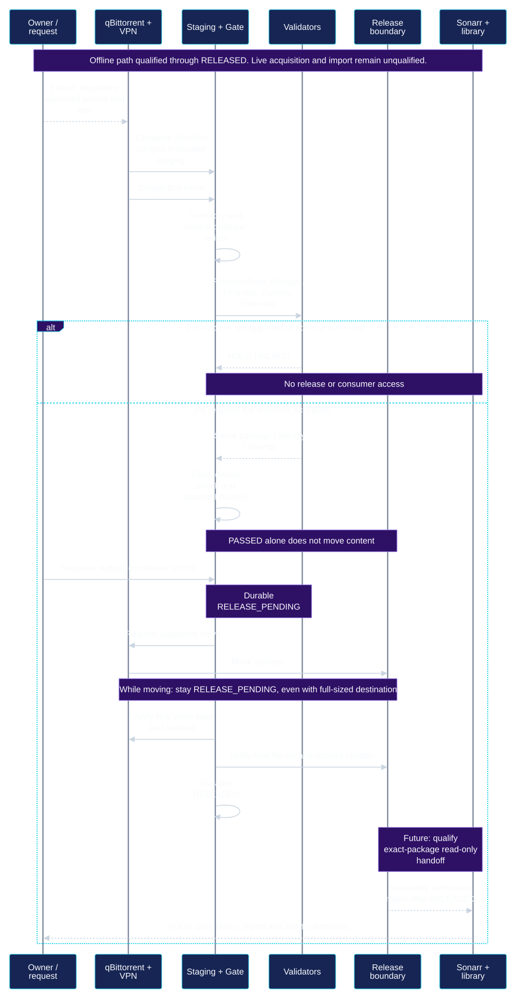

# Building a Fail-Closed Media Acquisition Pipeline

[Project overview](../README.md) · [Current state](current-state.md) · [Roadmap](roadmap.md)

**Production admission and release boundary qualified; one owner-authorized controlled Internet pilot remains.**

Reconciled October 6, 2026 from the selected October 4 final-admission checkpoint. This is dated campaign evidence, not a new live runtime audit.

NOVA is my personal infrastructure engineering project across Windows, Linux, WSL2 and Docker. This case study describes how I separated untrusted downloads, validation, release and import. It is an account of a bounded engineering qualification, with explicit limits on what was proved.

## Problem

The original media automation design gave download clients and media managers broad access to a shared filesystem. That made the workflow convenient, but it did not establish a clear point at which downloaded bytes became eligible for import. A scanner result alone could not solve the problem: a consumer that could already read the file might import it before validation or during a move.

I needed a practical workflow that preserved existing library state while making the trust transitions explicit. The design had to fail closed when a parser, scanner, runtime dependency or identity check failed, and retain enough evidence to diagnose and recover without silently approving content.

## Design and boundaries

The deployed portion uses isolated Linux staging, a durable validation ledger and a separate release destination. Media managers cannot see staging or moving release content. The download client performs the supported move; the Gate decides whether the observed result satisfies the release contract.

[Open diagram](../diagrams/nova-gate-sequence.svg) · [Mermaid source](../diagrams/nova-gate-sequence.mmd)

The diagram retains the earlier scanner-preflight checkpoint. The later final-admission milestone qualifies the read-only disposable import design; its dashed production acquisition/import steps remain pending.

| Boundary | Decision |
|---|---|
| Untrusted Staging | Inventory exact files while controlling producer writes; consumers have no access. |
| Validation Gate | Accept only current, trusted evidence bound to the package, file identity, policy and attempt. |
| PASSED | Validation succeeded. No move follows merely from this state. |
| RELEASE_PENDING | A separately authorized, durable release intent exists; movement is still in progress. |
| RELEASED | The supported move completed and final identity was reverified. |
| Media Manager / Library | Read-only disposable copy contract qualified; production application needs exact owner authorization after RELEASED. |

**PASSED is not release permission. RELEASED is not IMPORTED.** The conceptual journey is `DOWNLOADING → VALIDATING → PASSED → RELEASE_PENDING → RELEASED → IMPORTED`; it omits intermediate Gate states for readability. IMPORTED is a media-manager outcome, not an added Gate state. Incomplete or unsupported evidence results in a hold; adverse evidence prevents progress and requires review.

## Layered validation

The same live package and inventory generation must pass:

1. **Path and inventory checks:** establish the permitted file set and content identity.
2. **Filename/type policy:** correlate naming with actual file evidence.
3. **libmagic:** inspect the file signature through the qualified launcher.
4. **Sandboxed FFprobe:** check supported media structure under bounded input and execution limits.
5. **ClamAV:** require a completed, current, clean result within its supported size range.
6. **Microsoft Defender:** obtain an exact-file result through the trusted Windows boundary.
7. **Final identity revalidation:** confirm that the evidence still describes the bytes being approved.

Runtime resources and scanner definitions are part of that contract. Drift or incomplete execution stops progress. Historical receipts remain available for interpretation and replay, but cannot grant new execution or release authority. Synthetic and imported evidence cannot impersonate a live validator.

Two scanners reduce risk; clean results do not prove absolute safety. Unsupported content stays held rather than being accepted by a fallback assumption.

## The asynchronous move lesson

One important result came from observing the actual cross-filesystem move. The download client's API acknowledged the request before the operation finished. A destination file with the expected final size was already visible while the client still reported moving.

Across **ten moving-state observations**, the Gate stayed in RELEASE_PENDING. It committed RELEASED only after terminal client state, the expected destination and file set, source disposition, and final content identity all satisfied the contract.

This is why the whole release directory must remain hidden from consumers. A final-looking filename, file size or successful HTTP response is insufficient evidence. The proposed import handoff exposes only the exact released package after the decision is durable.

## Failure handling and recovery

The work exposed several ordinary operational failure modes: a library update changed a pinned runtime identity, scanner database layout changed, sandbox startup encountered a resource limit, and production service restrictions blocked a scanner launch. Each stopped validation rather than being converted into approval.

An initial production attempt exhausted its bounded retry budget. I preserved that failed attempt and its history. After scanner preflight demonstrated that the runtime defect was resolved, a separately authorized fresh offline package completed on attempt one with no validator retry. The old attempt was not reset, relabeled or made eligible again.

Normal service restarts were tested at PASSED and RELEASED. The durable ledger survived; PASSED did not trigger an automatic move, and RELEASED did not trigger a duplicate scan or move. A repeated completion signal for an existing package was rejected as new work. These results cover the tested restart/replay cases, not every possible crash or power-loss scenario.

## Verification and current status

Reconciled October 6, 2026 from the selected October 4 final-admission checkpoint. This is dated campaign evidence, not a new live runtime audit.

| Evidence | Result | Limit |
|---|---|---|
| Canonical Gate suite | **471/471 passed, zero skips** | Retained regression evidence |
| Deployment/admission suite | **26/26 passed, zero skips** | Supersedes the earlier 8/8 current count |
| Production admission | **QUALIFIED** | Bounded single-file pilot contract; offline-only wrapper no longer required |
| Production-shaped fixtures | **6.6 MB, 25 MB and 130 MB reached RELEASED** | Does not qualify every sub-ceiling input or arbitrary file set |
| Read-only released-package import | Disposable Sonarr copied the 130 MB fixture; source hash preserved | Design qualified; production mount transaction not yet applied |
| Sonarr staging visibility | **NONE** | Untrusted and moving content stays hidden |
| Sonarr Completed Download Handling | **OFF** | No production automatic-CDH pilot completed at this checkpoint |
| Internet acquisition | **NOT PERFORMED** | One exact owner-authorized controlled pilot remains |

Production-shaped admission is qualified beyond the earlier 16 MiB test constraint, and the release-to-media-manager boundary has been validated with a read-only disposable import contract.

The earlier whole-file cutoff came from a copied-input parser profile. Production now uses pinned, read-only disk input instead of materializing the whole file in memory. Memory, CPU, output and timeout bounds remain in place. The default copied-input profile's 16 MiB bound is not a generic media ceiling.

ClamAV's large-file ceiling is unchanged at **2,147,483,647 bytes**. Content above it remains HELD. Qualification through 130 MB does not guarantee every admissible file finishes within the retained resource limits.

**Production admission and release boundary qualified; one owner-authorized controlled Internet pilot remains.**

The campaign ended with Gate active, the VPN healthy, the downloader bound to its tunnel, zero torrents, empty staging/release, CDH OFF, disabled indexers and unchanged production media metadata. These are retained checkpoint facts.

The next step is an exact owner-authorized transaction: select one lawful/open item and source, perform one manual acquisition through genuine validation and durable RELEASED, expose only that verified package read-only, enable CDH at the appropriate authorized stage, observe actual import, and restore safe controls. Gate architecture development is not the next prerequisite. No production mount application, CDH enablement or Internet pilot completion is claimed here.

## Engineering takeaways

- Put trust boundaries in filesystem visibility as well as application settings.
- Treat runtime dependencies, signatures and evidence provenance as part of the input contract.
- Separate asynchronous acknowledgement, completion and consumer access.
- Make retries and recovery preserve history instead of erasing failures.
- Test the actual Windows/WSL/Linux boundary; Unix permissions alone do not establish cross-platform isolation.
- Keep qualification levels visible so a green test suite cannot be mistaken for a finished production workflow.

## Human-governed AI engineering

The owner sets objectives, protected state and authorization boundaries. FORGE/ORION planning roles organize scoped campaigns; Codex assists with implementation, diagnosis, tests and evidence. Each phase has acceptance criteria. Safe in-scope defects use **FIX AND CONTINUE**; accepted milestones use **CHECKPOINT AND CONTINUE**; missing authority or unsafe ambiguity requires **HARD STOP** for the affected scope.

This is an engineering workflow with human review and retained evidence. It does not grant an autonomous agent standing control over production. See [Operations and recovery](operations-and-recovery.md#human-governed-ai-engineering).
